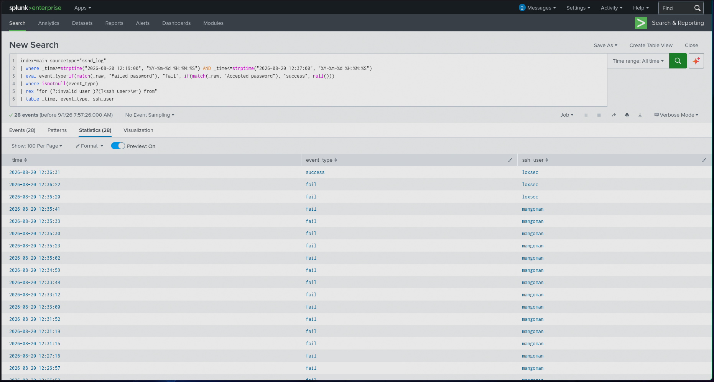

## 1. Architecture Diagram
````
┌─────────────────┐        SSH (22)         ┌──────────────────────┐
│  Android/Termux  │ ─────────────────────▶ │   Target host        │
│  (sshpass loop)  │                        │   OpenSSH server     │
│  10.142.129.140  │                        │                      │
└─────────────────┘                         │  /var/log/auth.log   │
                                            │  /var/log/sshd.log   │
                                            └──────────┬───────────┘
                                                       │ log forward
                                                       ▼
                                             ┌──────────────────────┐
                                             │  Splunk Free 10.2.3  │
                                             │  index=main          │
                                             │  sourcetype=sshd_log │
                                             │  (report, no         │
                                             │   scheduled alerting │
                                             │   on Free tier)      │
                                             └──────────────────────┘
````
## 2. Original Alert / Question

Does `/var/log/auth.log` show a pattern of repeated failed SSH logins followed by a success, consistent with brute-force behaviour — and if so, is it a real attack or a legitimate user struggling to authenticate?

There is no native scheduled alerting on Splunk Free, so this detection runs as a saved Report against a fail-streak-before-success threshold (`fail_streak >= 5` within a 15-minute window).

## 3. Raw Evidence & Timeline

Initial investigation (Section 3, original) used a hardcoded 12:33:00–12:36:31 window based on the fail_streak detection alone. Widening the window and extracting the `user` field revealed a materially different — and more accurate — picture. The regex initially failed to extract usernames for most rows because sshd logs invalid-account attempts as `Failed password for invalid user <name> from...`, not the plain `for <name> from` format the first regex expected. Fixed with `"for (?:invalid user )?(?<ssh_user>\w+) from"`.



**Corrected timeline — full attack window, 10.142.129.140, port 47000/41874:**

| Time | Event | Target account |
|---|---|---|
| 12:19:47 | success | `loxsec` |
| 12:23:47 – 12:35:41 | 24× fail | `mangoman` (invalid — account does not exist on system) |
| 12:36:20 | fail | `loxsec` |
| 12:36:22 | fail | `loxsec` |
| **12:36:31** | **success** | **`loxsec`** |

The full window (bounded by the two `loxsec` successes) spans **~17 minutes**, not the ~3-minute burst originally assumed. `fail_streak=26` from the detection query counts every fail between the 12:19:47 success and the 12:36:31 success — 24 of those were against a nonexistent account, only 2 were against the real one.


## 4. Competing Hypotheses & Investigation

Each hypothesis is a claim about what happened; each investigation step is the concrete action that would confirm or kill it.

| # | Hypothesis | Investigation step | Status |
|---|---|---|---|
| 1 | The fails and the success are the same account | Pull `user` field across all fail events + the success event, compare | **Resolved — false.** Two distinct usernames: `mangoman` (invalid, 24 attempts, account doesn't exist) and `loxsec` (real account, 2 fails then success) |
| 2 | The fails came from multiple different accounts, one unrelated success followed | Same query as #1 | **Resolved — true, but not unrelated.** The `mangoman` attempts and the `loxsec` compromise are one continuous session from the same source IP, not two coincidental events |
| 3 | Source is internal — mundane cause (forgotten password, stale automated credential) | Check `10.142.129.140` against RFC1918 ranges | **Resolved:** internal address (Termux simulation host, by lab design). In a real environment this is the first check to run, since it reframes the entire threat model |
| 4 *(if source is external)* | Attacker had partial recon on the account (targeted guess), not blind brute-force | Pull 30-day history for the account, look for prior failed-login spikes | Not applicable in this lab — no external source. Documented as the correct next branch for a real incident |
| 5 *(if attacker hypothesis survives)* | Attacker did something with access after the 12:36:31 success vs. session was benign | Pull all post-12:36:31 activity: commands, sudo attempts, new SSH keys, outbound connections | **Not yet done — the single largest remaining gap.** Without it, this is a confirmed compromise, not a completed incident narrative |

**Key finding:** the real account (`loxsec`) was compromised in only **2 failed attempts** before success — not 26. The bulk of the failure count (24 of 26) came from testing a nonexistent username (`mangoman`) first. This is a materially weaker password/detection story than the original "26-attempt brute force" framing implied — a real account falling in 2 tries points toward a weak or guessable password, not brute-force volume. This is the actual priority finding, not the raw fail count.

**Status note (carried forward, not indefinitely deferred):** the post-login session review is being intentionally deprioritized in favor of a broader investigation (BOTS v1) — the same triage call a working analyst makes with limited time. Will close this out and update the file in a follow-up pass.

---

## 5. The Query — Written With Its Own Bug History

**v1 — the bug:**
```spl
index=main sourcetype="sshd_log"
| eval event_type=if(match(_raw, "Failed password"), "fail", if(match(_raw, "Accepted password"), "success", null()))
| where isnotnull(event_type)
| sort _time
| streamstats count(eval(event_type="fail")) as running_fails reset_after="event_type=\"success\""
| eval fail_streak=if(event_type="success", running_fails, null())
| where isnotnull(fail_streak) AND fail_streak>=5
| streamstats current=f last(_time) as prev_fail_time
| eval time_gap_sec=_time-prev_fail_time
```
The `where` filter runs before `prev_fail_time` is calculated, stripping every fail row first. `streamstats last(_time)` then measures the gap between two *successes*, not fail→success. Produced a false 17-minute  "streak" bridging two unrelated sessions.

**v2 — fixed:**
```spl
index=main sourcetype="sshd_log"
| eval event_type=if(match(_raw, "Failed password"), "fail", if(match(_raw, "Accepted password"), "success", null()))
| where isnotnull(event_type)
| sort _time
| streamstats count(eval(event_type="fail")) as running_fails reset_after="event_type=\"success\""
| eval fail_time=if(event_type="fail", _time, null())
| streamstats current=f last(fail_time) as prev_fail_time
| eval fail_streak=if(event_type="success", running_fails, null())
| eval time_gap_sec=if(event_type="success", _time-prev_fail_time, null())
| eval fail_streak=if(time_gap_sec<=900, fail_streak, null())
| where isnotnull(fail_streak) AND fail_streak>=5
| table _time, event_type, fail_streak, time_gap_sec
```

**v3 — user-field extraction, added after v2 revealed a count discrepancy (11 vs 26) that turned out to matter:**
```spl
index=main sourcetype="sshd_log"
| where _time>=strptime("2026-08-20 12:19:00", "%Y-%m-%d %H:%M:%S") AND _time<=strptime("2026-08-20 12:37:00", "%Y-%m-%d %H:%M:%S")
| eval event_type=if(match(_raw, "Failed password"), "fail", if(match(_raw, "Accepted password"), "success", null()))
| where isnotnull(event_type)
| rex "for (?:invalid user )?(?<ssh_user>\w+) from"
| table _time, event_type, ssh_user
```
First version of this regex (`"for (?<ssh_user>\w+) from"`) silently failed on most rows because sshd logs invalid-account attempts as `Failed password for invalid user <name> from...`, not the plain `for <name> from` format assumed. Fixed by optionally absorbing `invalid user ` before capturing the name. This query is what surfaced the two-account finding above.

**v4 — inter-fail gap, still queued, not yet run:**
```spl
index=main sourcetype="sshd_log"
| eval event_type=if(match(_raw, "Failed password"), "fail", if(match(_raw, "Accepted password"), "success", null()))
| where isnotnull(event_type)
| sort _time
| streamstats count(eval(event_type="fail")) as running_fails reset_after="event_type=\"success\""
| eval fail_time=if(event_type="fail", _time, null())
| streamstats current=f last(fail_time) as prev_fail_time
| eval inter_fail_gap_sec=if(event_type="fail", _time-prev_fail_time, null())
| where event_type="fail"
| table _time, running_fails, inter_fail_gap_sec
```
**Result: not yet run.** Would show whether the `mangoman` attempts were evenly spaced (scripted) or irregular (manual/throttled).

---

## 6. False Positives & Limitations

- **Confirmed false positive, caught and fixed (v1→v2):** a 50-hour cross-session false match, caused by pipe-ordering in the original query.
- **Confirmed misreading, caught and fixed (v2→v3):** the original narrative assumed all 26 fails targeted the same account. They didn't — 24 targeted a nonexistent username, only 2 targeted the real account. The regex bug that hid this (silently failing on "invalid user" lines) is itself a reminder that a blank/null field should be investigated, not assumed benign.
- **Single-source limitation:** all traffic originates from the lab's own Termux host — no genuine external-vs-internal contrast available in this dataset.
- **Open, not yet resolved:** inter-fail timing distribution (v4) hasn't been run.
- **No post-login session data pulled yet** (Hypothesis 5) — the largest remaining gap, intentionally carried forward rather than closed (see Section 4 status note).

---

## 7. Remediation & Validation Test

**Remediation (documented as the correct response; lab environment, not actually executed):**
- Force password reset on `loxsec` — a real account compromised in 2 attempts indicates a weak or guessable password, independent of the `mangoman` noise.
- Investigate why `mangoman`-style username enumeration is possible at all without triggering a lockout or rate limit after repeated invalid-user attempts.
- Recommend key-based SSH auth only, disable password auth, restrict SSH to known source ranges.

**Validation test performed:** reran the v2 query end to end — one detection survived the `fail_streak>=5` filter as expected. Reran with the corrected v3 regex across the full 12:19–12:37 window and confirmed the two-account breakdown against the raw `_raw` text directly (Section 3), not just inferred from counts.

---

## 8. Decision Flowchart (Tier-1)

```
Failed SSH logins detected
        │
        ▼
Fail-streak ≥5 within 15 min, before a success?
   │Yes                          │No
   ▼                             ▼
Flag as detection          Continue monitoring, no action
   │
   ▼
Pull username field for every fail + the success — same account throughout?
   │Yes                          │No — mixed accounts (this case)
   ▼                             ▼
Continue to source-IP check   Separate the noise from the real hit:
                               how many fails hit the REAL account
                               specifically, not the total count
                               │
                               ▼
                          Source internal (RFC1918) or external?
                               │Internal                │External
                               ▼                         ▼
                        Check for stale/misconfigured   Escalate to Tier 2 — pull
                        automation before closing         post-login session activity
```

## Metrics

- **MTTD (estimated):** ~3–4 minutes from raw detection query to identifying the fail-streak pattern.
- **MTTR:** not applicable — no containment action executed in this lab.

## One-Page Summary (Non-Technical)

On August 20, a monitored server logged 26 failed SSH login attempts over a 17-minute window, followed by a successful login. Initial analysis assumed all 26 attempts targeted the same account — deeper investigation found this wasn't accurate. 24 of the attempts targeted a username that doesn't exist on the system; the remaining 2 attempts, against the real account, succeeded on the second try.

That distinction matters: this wasn't a brute-force attack that finally wore down one account after 26 guesses. It was a short burst of username guessing against a fake account, followed by a real account being compromised in just two attempts — a much weaker password story than the raw numbers first suggested. The investigation also caught and fixed two of its own detection logic bugs along the way: a false alert that bridged two unrelated login sessions, and a blank data field that was hiding this exact finding until the extraction logic was corrected.

**Next steps:** reset the compromised account's password and review why it fell in two tries; review post-login session activity to confirm whether the access was used (largest remaining gap); consider rate-limiting or lockout after repeated invalid-username attempts, since 24 failed guesses against a fake account produced no alert of its own.
